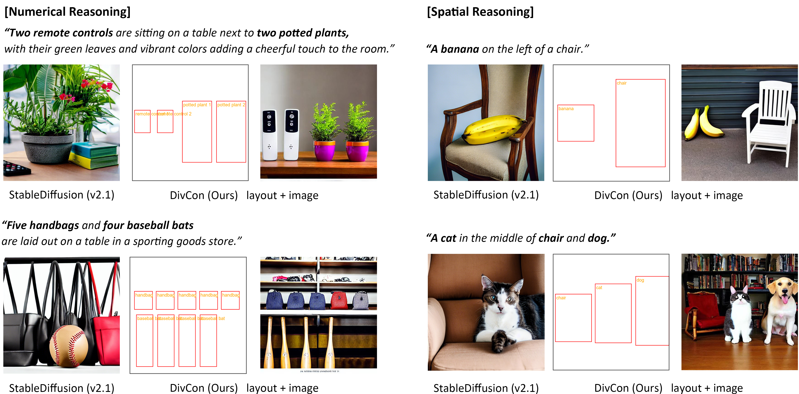

# DivCon: Divide and Conquer for Progressive Text-to-Image Generation

<!-- [[Website]( )][[Demo]( )] -->

<!-- [[Paper]( )] -->



## Dependencies
In your environment where Python version is 3.8 or higher, or alternatively, create a new environment:

```bash
conda create --name divcon python==3.8.0
conda activate divcon
```
and install related libraries

```bash
conda install pytorch torchvision torchaudio pytorch-cuda=11.7 -c pytorch -c nvidia
pip install -r requirements.txt
pip install git+https://github.com/CompVis/taming-transformers.git
pip install git+https://github.com/openai/CLIP.git
```
## Inference: Predict layouts with DivCon 
We provide scripts to generate layouts for HRS and NSR-1K benchmark. First navigate to ```./LLM_gen_layout```, and set up your openai authentication at line 47:
```bash
cd LLM_gen_layout
```
Then run:
```bash
# for numerical prompts
python llm_gen_layout_counting.py --dataset HRS
# or for spatial prompts
python llm_gen_layout_spatial.py --dataset HRS
```
The generated layouts will be saved to ```./LLM_gen_layout``` by default.

We also provide generated layout for both benchmarks at the ```./LLM_gen_layout```.

## Inference: Generate images with DivCon

Download the layout conditioned model [GLIGEN](https://huggingface.co/gligen/gligen-generation-text-box/blob/main/diffusion_pytorch_model.bin) and put them in `gligen_checkpoints`

To generate images from numerical prompts in HRS using layouts predicted by divcon, run:
```bash
python divcon_gen.py --ckpt gligen_checkpoints/diffusion_pytorch_model.bin --file_save HRS 
                     --type counting --pred_layout ./LLM_gen_layout/HRS_counting.p
```
Where
- `--ckpt`: Path to the GLIGEN checkpoint
- `--file_save`: Path to save the generated images
- `--type`: The category to test, counting or spatial
- `--pred_layout`: Path to the predicted layout from LLM
- `--use_llm`: Whether to use LLM to generate the layout. If you're using LLM (GPT-4), set your openai API key as follows:
```bash
export OPENAI_API_KEY='your-api-key'
```
You can modify these input parameters to generate images for different benchmarks or categories.

## Layout & Image Evaluation
To evaluate the raw layouts, navigate to ```LLM_gen_layout``` and run:
```bash
cd LLM_gen_layout
# for numerical prompts in HRS benchmark
python eval_counting_layout.py --pred_layout HRS_counting.p
# or for spatial prompts in HRS benchmark
python eval_spatial_layout.py --pred_layout HRS_spatial.p
```
To evaluate the generated images using YOLOv8, navigate to ```evaluation``` and first run:
```bash
cd evaluation
python YOLOv8.py --in_folder ../visual/HRS_img --out_file HRS_detect.p
```
then run evaluation scripts:
```bash
# for numerical prompts in HRS benchmark
python eval_counting.py --in_result detection_result/HRS_detect.p
# or for spatial prompts in HRS benchmark
python eval_spatial.py --in_result detection_result/HRS_detect.p
```

## Acknowledgements

This project is built upon the foundational work from [**GLIGEN**](https://github.com/gligen/GLIGEN) and [**Attention-Refocusing**](https://github.com/Attention-Refocusing/attention-refocusing).

 